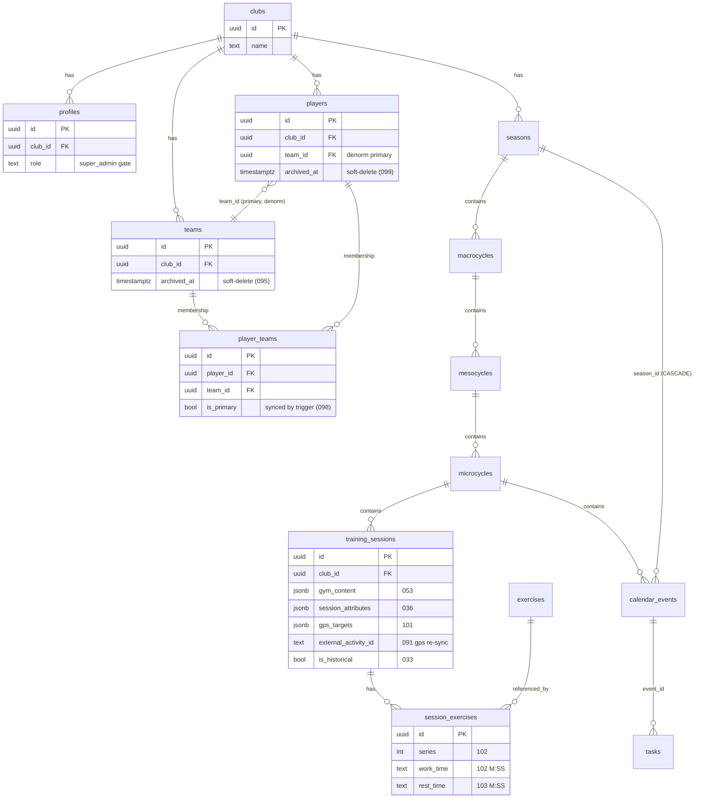
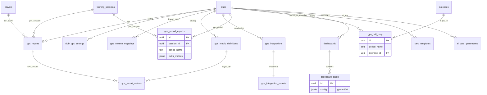
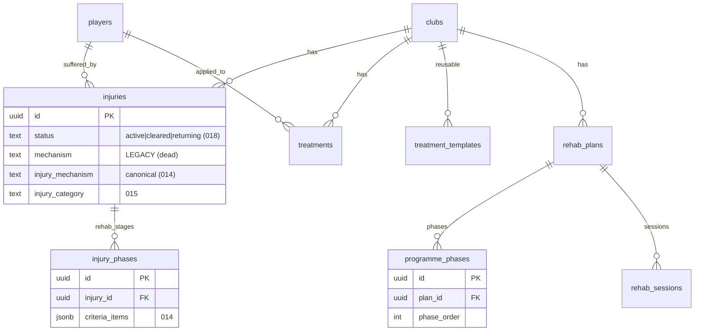
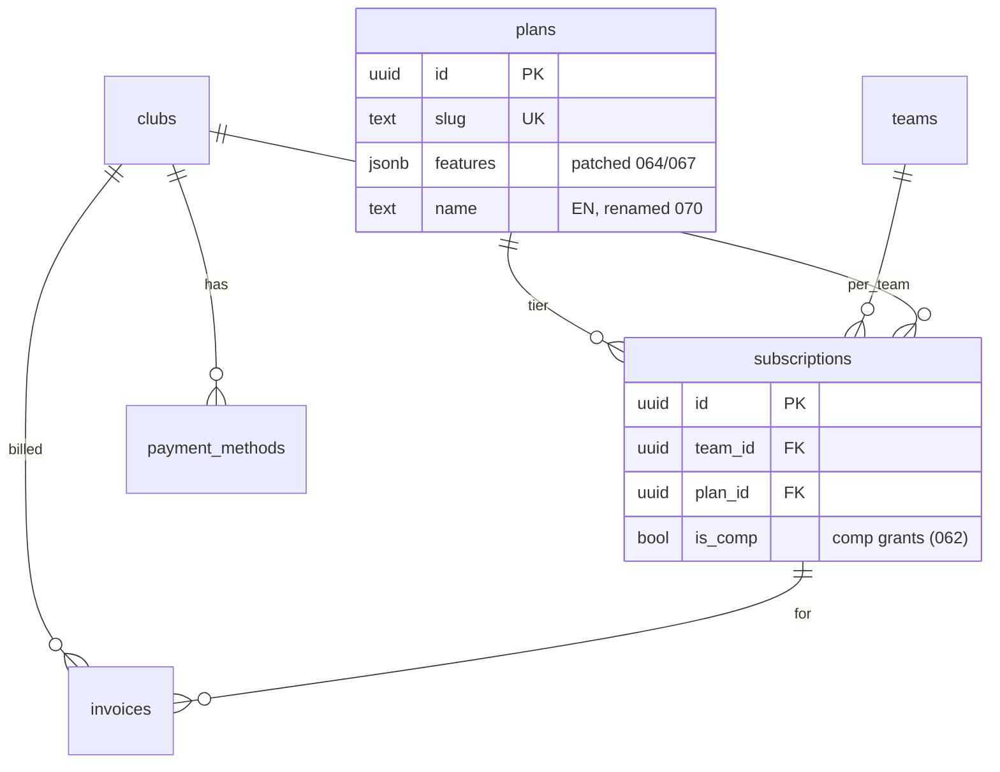
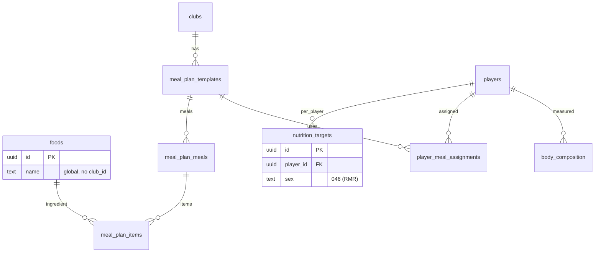

# Auditoría de migraciones SQL — ClavaMetrics

> Generado el 2026-06-26. Cubre `migrations/*.sql` (004→103) + `migrations/legacy/`.
> Objetivo: entender el estado real del esquema, detectar archivos muertos/duplicados
> y proponer una baseline consolidada + diagrama de tablas.

---

## 1. Resumen ejecutivo (lo que importa)

1. **El esquema base NO está en `migrations/`.** Las tablas núcleo —`clubs`, `profiles`,
   `players`, `training_sessions` (83 referencias en código), `exercises`, `gym_exercises`,
   `session_exercises`, `microcycles`, `calendar_events`, `gps_reports`, `injuries`,
   `treatments`, `wellness`, `rpe`, etc.— se crearon **fuera** de esta carpeta (directo en
   la DB de Supabase). `migrations/` solo agrega ~47 tablas **periféricas** (GPS builder,
   video, nutrición, lineups, billing, dashboards, rehab phases) + columnas y funciones.
   → **Cualquier "diagrama real" debe partir de la DB, no del folder.** Ver §6.

2. **No hay runner de migraciones.** Se aplican a mano (no hay `supabase/migrations`,
   ni tabla `schema_migrations`, ni config). Por eso hay **números duplicados** y
   **headers con número equivocado**: nada valida el orden.

3. **Mucho archivo es ruido histórico.** ~15 migraciones son correcciones de otras
   (cadenas de supersesión, §3) o data-fixes de una sola vez. El esquema final se podría
   describir con bastante menos.

4. **3 tablas creadas por migración nunca se usan en código:** `card_templates`,
   `default_exercises` (tabla semilla, solo backend), `taxonomy_aliases` (solo backend).

5. **No editar migraciones ya aplicadas.** La forma correcta de "simplificar" es generar
   una **baseline consolidada** (snapshot del esquema real) como nueva fuente de verdad y
   archivar las históricas. Ver §7.

---

## 2. Problemas estructurales del folder

### 2.1 Números duplicados (orden de aplicación ambiguo)
| Nº | Archivo A | Archivo B | ¿Conflicto? |
|----|-----------|-----------|-------------|
| 014 | `bamic_and_phase_criteria` (injuries) | `microcycle_publish_state` (microcycles) | No, tablas disjuntas |
| 015 | `club_settings_season` (club_settings) | `injury_category_classification` (injuries) | No, disjuntas |
| 029 | `club_assets_bucket` (storage) | `club_gps_settings` (tabla) | No, disjuntas |
| 044 | `exercise_library_seed` | `nutrition_module` | No, dominios distintos |
| 045 | `exercise_seed_security_definer` | `nutrition_foods_seed` | No, cada uno sigue a su 044 |

Ninguno colisiona en objetos, pero el doble número rompe cualquier ordenamiento por nombre.

### 2.2 Headers con número equivocado (copy-paste)
- `029_club_assets_bucket` → comentario interno dice "Migration 028".
- `087` dice "086", `088` dice "087", `089` dice "088", `090` dice "089", `100` dice "099".
- Cosméticos, pero confunden al consolidar.

### 2.3 `legacy/` sin numerar
15 archivos sin prefijo (`availability_*`, `calendar_events.sql`, `tasks_table.sql`,
`training_sessions_new_columns.sql`, …). Son los predecesores del esquema base. Documentan
historia pero **no forman parte de la secuencia** y no deben re-aplicarse.

---

## 3. Cadenas de supersesión (archivos muertos o subsumidos)

Estas son las correcciones iterativas que pedías detectar. La columna **"Estado final"**
indica qué versión sobrevive; lo demás es ruido que la baseline puede colapsar.

| Cadena | Qué pasó | Estado final / vivo |
|--------|----------|---------------------|
| **012 → 013** `injury_phases` | 013 re-crea la tabla de 012 con columnas extra (phase_type, criteria…) | Solo **013** |
| **016 → 017 → 018** `injuries.status` | Constraint cambiado 3× (resolved → cleared/returning). 017 tenía bug de orden | Solo **018** = `(active, cleared, returning)` |
| **020 + 021 → 022** lineups | 022 re-aplica las mismas columnas/constraint (estaban faltando en prod) | **022** (020/021 redundantes) |
| **024 → 025** calendar type | 024 solo documenta; 025 cambia el CHECK real | Solo **025** |
| **039 → 040** gps_builder flag | 039 default false; 040 lo flipa a true al instante | Solo **040** |
| **038 → 042** dashboards RLS | 042 reemplaza la policy "FOR ALL" por 4 granulares | **042** |
| **051 → 052** programme_phases | 052 `DROP CASCADE` + recrea (la DB tenía schema viejo) | Solo **052** |
| **044exercise → 045** seed fn | 045 agrega SECURITY DEFINER (044 sembraba 0 filas por RLS) | **045** |
| **055 → 058** plans | 055 no-op (tabla preexistía); 058 agrega cols + UPSERT seed | **058** |
| **016draft → 057/059** subs/invoices | DROP+CREATE para descartar tablas stripe viejas | **057/059** |
| **060 → 061** platform_admins | 061 **revierte 060 entero** (tabla + fn dropeadas) | Ninguno: queda solo policy con `is_super_admin()` |
| **055/058 → 064/067/070** plans data | 3 UPDATEs posteriores mutan features/name | features/name finales ≠ seed |
| **071 → 073** gps_integrations | 073 agrega status `configured` + reescribe `set_gps_credential` | **073** |
| **074 → 075 → 076 → 077** survey fns | `submit_survey` reescrita 4×, `wellness_status` 3× | Solo la última de cada una |
| **097 → 100** `v_exercise_gps_profile` | 100 drop+recrea agregando columnas `_avg` (volumen) | **100** (la tabla+otra view de 097 siguen vivas) |
| **096 → 098** player_teams | 098 agrega trigger que mantiene `players.team_id = is_primary` | Ambas (098 complementa) |
| **101 → 102 → 103** daily planning | 3 migraciones de 1 columna c/u sobre session_exercises/training_sessions | Las 3 (fusionables en 1) |

**Funciones reescritas múltiples veces** (solo la última corre): `submit_survey` (074/075/077),
`wellness_status` (074/075/076), `set_gps_credential` (071/073), `seed_default_exercises_for_club`
(044/045), `session_rpe_status` (083), `set_updated_at` (redefinida en 019 y 034).

---

## 4. Artefactos muertos / redundantes

**Columnas duplicadas u obsoletas en tablas core:**
- `injuries.mechanism` (012/013, free-text) vs `injuries.injury_mechanism` (014, con CHECK) — la
  primera quedó legacy, nunca dropeada.
- `exercises.preview_svg` (082) vs `preview_png` (084) vs `preview_path` + bucket (085) — **tres
  estrategias** de preview de drills agregadas en cascada. Si la app estandarizó en el bucket
  (085), las dos inline (082/084) son ruido. ⚠️ Verificar contra `Exercises Library.html` antes de dropear.

**Tablas creadas por migración sin uso en código (candidatas a deprecar):**
| Tabla | Migración | Nota |
|-------|-----------|------|
| `card_templates` | 038 | 0 referencias en todo el repo |
| `default_exercises` | 044 | Tabla semilla; la app lee `exercises`/`gym_exercises`, nunca esta |
| `taxonomy_aliases` | 089 | Solo backend (normalización `cm_norm`), 0 refs cliente |
| `platform_admins` | 060→061 | **Ya dropeada** por 061; pero código (`invite-staff`, `Chat & Tasks`) aún la nombra → revisar |

> ⚠️ `platform_admins` aparece referenciada en `supabase/functions/invite-staff/index.ts` y
> `Chat & Tasks.html` aunque la migración 061 la eliminó. Esto es **drift activo**: o el código
> está roto, o la tabla volvió a crearse fuera de migraciones. Confirmar (memoria del proyecto dice
> que el super admin real es `is_super_admin()` vía `profiles.role`, no esta tabla).

**Data-fixes de una sola vez (no son esquema; la baseline puede omitir el cuerpo, conservar el DDL):**
- 088 §2/§3 (valores + propagación taxonomía), 089 (backfill club rows), 096 (backfill memberships),
  099 (`status='inactive'` → `archived_at`), 048/035 (seeds de métricas), 040 (backfill flag).

---

## 5. Inconsistencias de tipos a confirmar antes de consolidar

- **`microcycles.id` y `calendar_events.id` se referencian como `text`** en FKs (019 `lineups.microcycle_id`,
  023 `share_links.mc_id`). Si los PK reales son UUID, hay un mismatch latente. Confirmar en la DB.
- `session_exercises`: `series integer` pero `work_time`/`rest_time` son `text` ("M:SS", para espejar
  `exercises`). Sin CHECK — validación en app. (Decisión deliberada, documentada en 103.)
- `gps_targets jsonb NOT NULL DEFAULT '{}'` — sin validación de shape.

---

## 6. Diagrama de tablas (big picture)

> Núcleo (gris, creado fuera de `migrations/`) + módulos periféricos (creados por migración).
> Dividido por dominio para que sea legible. PK/FK clave; columnas omitidas por brevedad.

### 6.1 Núcleo multi-tenant + planificación



### 6.2 GPS (import → métricas → builder/dashboards → projection)


> Views: `v_exercise_gps_profile` (097, redef 100 con `_avg` volumen), `v_gps_period_names` (097).

### 6.3 Lesiones / Rehab / Tratamientos



### 6.4 Billing / Plans / Subscriptions


> `platform_admins` (060) fue **eliminada por 061**. Gating real = `is_super_admin()` (profiles.role).
> Resolvers (funciones, no tablas): `team_plan_slug`, `team_features`, `team_has_feature`,
> `my_plan_features`, `club_has_feature`.

### 6.5 Nutrición



### 6.6 Otros módulos
- **Lineups:** `lineups` → `lineup_players`, `lineup_staff`; `club_branding`, `opponent_branding`; view `v_next_match_lineup`.
- **Video:** `videos` → puentes `video_sessions`, `video_players`, `video_matches`.
- **Match reports:** `match_results` → `player_match_stats`.
- **Comunicación/varios:** `notifications`, `channel_reads`, `share_links` (multi-scope: mc / nutrition / player), `activity_log` (audit, poblado por triggers 080/081).
- **Exercise library:** `default_exercises` (semilla, no leída por cliente), `taxonomy_aliases` (backend), `gym_session_templates`.

---

## 7. Plan de simplificación propuesto

**Principio:** no tocar migraciones ya aplicadas en prod (re-correrlas rompería). Simplificar
= crear una **fuente de verdad consolidada** y archivar el ruido.

### Paso 1 — Baseline única (mayor impacto)
Generar un dump real del esquema de Supabase y guardarlo como `migrations/000_baseline.sql`
(o `db/schema.sql`). Esto captura **todo** —incluyendo las ~44 tablas que hoy no están en el
folder— y se vuelve la referencia única. Comando:
```bash
supabase db dump --schema public > db/schema.sql   # requiere supabase CLI linkeada
# o pg_dump --schema-only contra la connection string del proyecto
```
A partir de ahí, `database_schema.md` (hoy narrativo, 823 líneas, parcial) pasa a ser solo el
diagrama de §6, y el SQL real vive en el dump.

### Paso 2 — Carpeta `migrations/applied/`
Mover las 103 históricas a `migrations/applied/` (read-only, registro histórico). Renumerar NO
—ya corrieron. Solo se documenta que el estado vivo es la baseline del Paso 1.

### Paso 3 — Adoptar el runner de Supabase para lo nuevo
Nuevas migraciones bajo `supabase/migrations/` con timestamp (`supabase migration new`). Mata de
raíz los números duplicados y el "lo apliqué a mano y me olvidé".

### Paso 4 — Limpieza de drift (requiere confirmar en DB)
1. Decidir `exercises.preview_svg`/`preview_png` vs `preview_path` → dropear las 2 muertas.
2. Resolver `platform_admins`: confirmar si existe en la DB; arreglar `invite-staff` y
   `Chat & Tasks.html` para usar `is_super_admin()`.
3. Dropear `card_templates`, `taxonomy_aliases` si se confirma 0 uso.
4. Confirmar tipo de `microcycles.id`/`calendar_events.id` (text vs uuid) y alinear FKs.
5. Borrar `injuries.mechanism` legacy tras migrar datos a `injury_mechanism`.

### Paso 5 — Quick wins inmediatos (sin riesgo)
- Fusionar `101+102+103` mentalmente como "daily planning fields" (ya aplicadas; solo doc).
- Corregir los headers con número equivocado **solo si** se conservan los archivos como doc.

---

## 8. Apéndice — fuentes
Auditoría cruzada de los 103 archivos `migrations/*.sql` + `migrations/legacy/` + grep de uso real
en `assets/`, `lib/`, `*.html`, `supabase/functions/`. Detalle por-migración disponible bajo demanda.
</content>
</invoke>
