# Diagrama de tablas — ClavaMetrics (esquema real)

> Generado el 2026-06-26 por **introspección en vivo** de la DB de Supabase
> (proyecto `xesrumijvdmqjrufgeka` / Kime-app, PostgreSQL 17.6) vía Management API.
> Fuente de verdad estructural: [`db/schema.sql`](../db/schema.sql).
>
> **104 tablas**, **205 foreign keys**, 4 vistas, 60 funciones.
> Las relaciones de los diagramas salen de los FKs **reales** de la DB.

## Leyenda
- ⚠️ = tabla **sin `create table` en `migrations/`** (creada directo en la DB / `legacy/`). Son 57.
- Atributos omitidos salvo PK/FK clave. Esquema completo en `db/schema.sql`.

## Núcleo multi-tenant

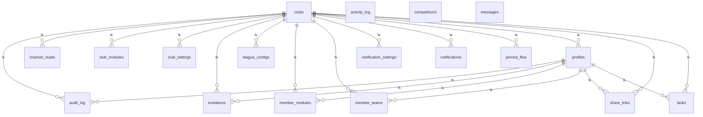

Tablas: activity_log, ⚠️audit_log, channel_reads, ⚠️club_modules, ⚠️club_settings, ⚠️clubs, ⚠️competitions, ⚠️invitations, ⚠️league_configs, ⚠️member_modules, ⚠️member_teams, ⚠️messages, ⚠️notification_settings, notifications, ⚠️pinned_files, ⚠️profiles, share_links, ⚠️tasks

FK a otros dominios: `channel_reads`→`teams`, `competitions`→`seasons`, `member_teams`→`teams`, `messages`→`teams`, `pinned_files`→`teams`, `share_links`→`microcycles`, `share_links`→`players`, `share_links`→`teams`, `share_links`→`training_sessions`, `tasks`→`calendar_events`, `tasks`→`teams`

## Equipos y jugadores

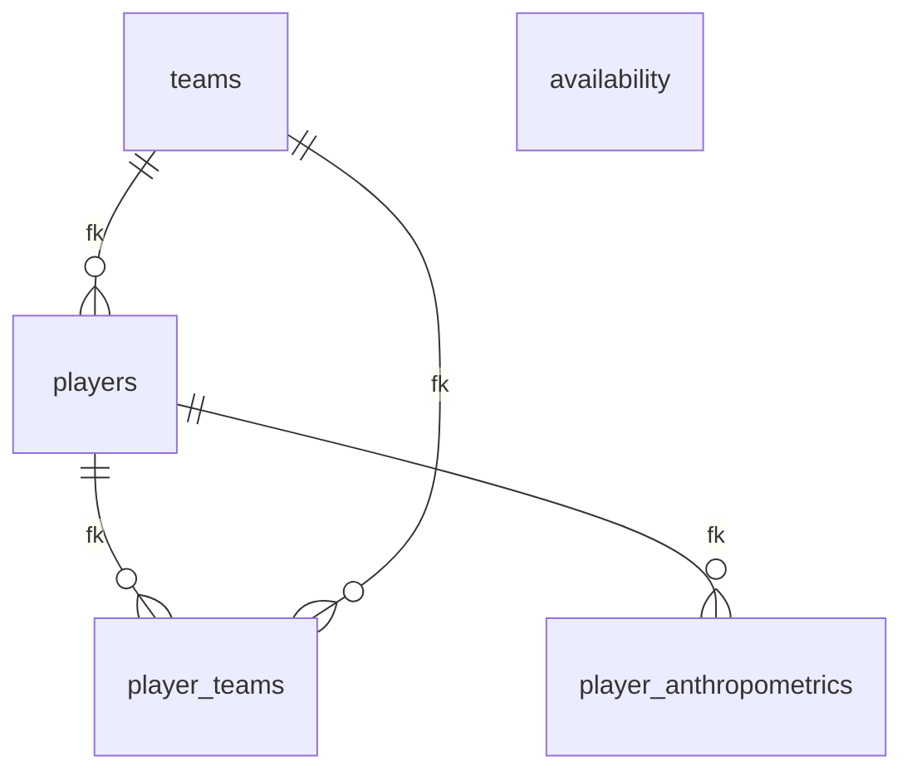

Tablas: ⚠️availability, ⚠️player_anthropometrics, player_teams, ⚠️players, teams

FK a otros dominios: `player_anthropometrics`→`clubs`, `player_teams`→`clubs`, `players`→`clubs`, `teams`→`clubs`

## Planificación / Periodización

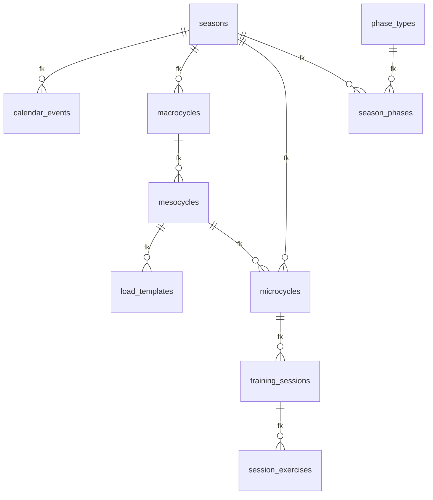

Tablas: ⚠️calendar_events, ⚠️load_templates, ⚠️macrocycles, ⚠️mesocycles, ⚠️microcycles, ⚠️phase_types, ⚠️season_phases, ⚠️seasons, ⚠️session_exercises, ⚠️training_sessions

FK a otros dominios: `calendar_events`→`clubs`, `calendar_events`→`competitions`, `calendar_events`→`teams`, `microcycles`→`profiles`, `microcycles`→`teams`, `phase_types`→`clubs`, `seasons`→`clubs`, `seasons`→`teams`, `session_exercises`→`clubs`, `session_exercises`→`exercises`, `session_exercises`→`gym_exercises`, `training_sessions`→`clubs`, `training_sessions`→`profiles`, `training_sessions`→`teams`

## Ejercicios / Drills

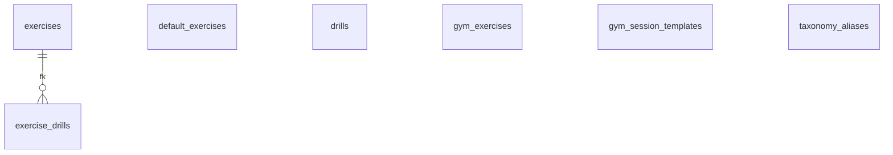

Tablas: default_exercises, ⚠️drills, ⚠️exercise_drills, ⚠️exercises, ⚠️gym_exercises, gym_session_templates, taxonomy_aliases

FK a otros dominios: `drills`→`clubs`, `drills`→`profiles`, `drills`→`training_sessions`, `exercises`→`clubs`, `exercises`→`profiles`, `gym_exercises`→`clubs`, `gym_session_templates`→`clubs`

## GPS

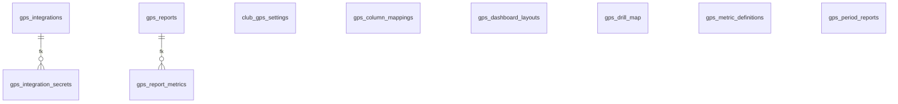

Tablas: club_gps_settings, gps_column_mappings, ⚠️gps_dashboard_layouts, gps_drill_map, gps_integration_secrets, gps_integrations, gps_metric_definitions, gps_period_reports, gps_report_metrics, ⚠️gps_reports

FK a otros dominios: `club_gps_settings`→`clubs`, `gps_column_mappings`→`clubs`, `gps_dashboard_layouts`→`clubs`, `gps_dashboard_layouts`→`profiles`, `gps_drill_map`→`clubs`, `gps_drill_map`→`exercises`, `gps_integrations`→`clubs`, `gps_metric_definitions`→`clubs`, `gps_period_reports`→`clubs`, `gps_period_reports`→`players`, `gps_period_reports`→`training_sessions`, `gps_report_metrics`→`clubs`, `gps_reports`→`clubs`, `gps_reports`→`players`, `gps_reports`→`training_sessions`

## Chart Builder / Dashboards

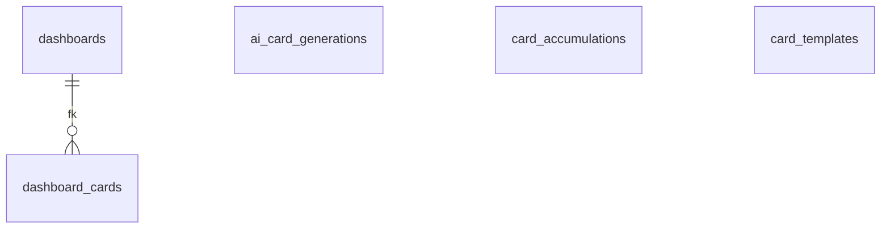

Tablas: ai_card_generations, ⚠️card_accumulations, card_templates, dashboard_cards, dashboards

FK a otros dominios: `ai_card_generations`→`clubs`, `card_accumulations`→`clubs`, `card_accumulations`→`league_configs`, `card_accumulations`→`players`, `card_templates`→`clubs`, `dashboards`→`clubs`

## Force tests

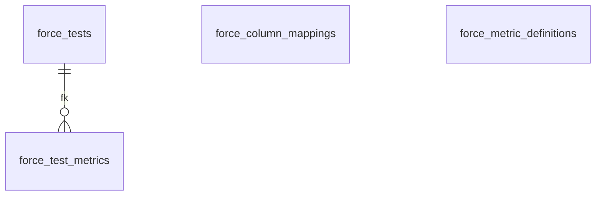

Tablas: ⚠️force_column_mappings, ⚠️force_metric_definitions, ⚠️force_test_metrics, ⚠️force_tests

FK a otros dominios: `force_column_mappings`→`clubs`, `force_metric_definitions`→`clubs`, `force_test_metrics`→`clubs`, `force_tests`→`clubs`, `force_tests`→`players`, `force_tests`→`teams`

## Lesiones / Rehab / Físio

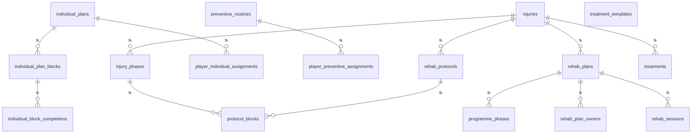

Tablas: ⚠️individual_block_completions, ⚠️individual_plan_blocks, ⚠️individual_plans, ⚠️injuries, injury_phases, ⚠️player_individual_assignments, ⚠️player_preventive_assignments, ⚠️preventive_routines, programme_phases, ⚠️protocol_blocks, ⚠️rehab_plan_owners, ⚠️rehab_plans, ⚠️rehab_protocols, ⚠️rehab_sessions, treatment_templates, ⚠️treatments

FK a otros dominios: `individual_block_completions`→`players`, `individual_plans`→`clubs`, `individual_plans`→`players`, `individual_plans`→`profiles`, `injuries`→`clubs`, `injuries`→`players`, `injuries`→`profiles`, `injury_phases`→`clubs`, `injury_phases`→`profiles`, `player_individual_assignments`→`players`, `player_individual_assignments`→`profiles`, `player_preventive_assignments`→`players`, `player_preventive_assignments`→`profiles`, `preventive_routines`→`clubs`, `preventive_routines`→`profiles`, `programme_phases`→`clubs`, `rehab_plan_owners`→`profiles`, `rehab_plans`→`clubs`, `rehab_plans`→`players`, `rehab_protocols`→`clubs`, `rehab_protocols`→`profiles`, `treatment_templates`→`clubs`, `treatments`→`clubs`, `treatments`→`players`, `treatments`→`profiles`

## Wellness / RPE / Evaluaciones

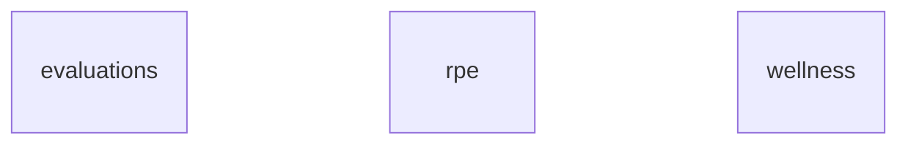

Tablas: ⚠️evaluations, ⚠️rpe, ⚠️wellness

FK a otros dominios: `evaluations`→`clubs`, `evaluations`→`players`, `rpe`→`clubs`, `rpe`→`players`, `rpe`→`training_sessions`, `wellness`→`clubs`, `wellness`→`players`, `wellness`→`profiles`

## Nutrición

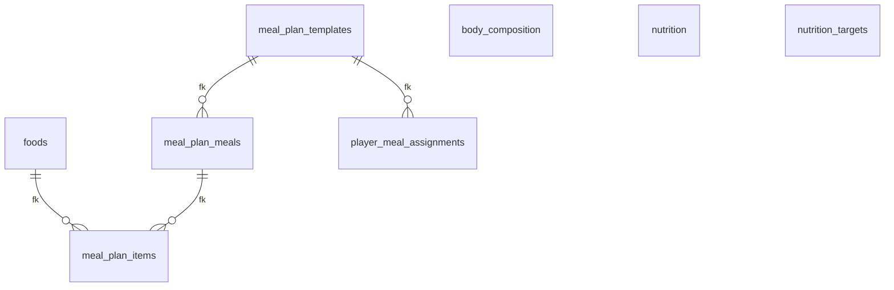

Tablas: body_composition, foods, meal_plan_items, meal_plan_meals, meal_plan_templates, ⚠️nutrition, nutrition_targets, player_meal_assignments

FK a otros dominios: `body_composition`→`clubs`, `body_composition`→`players`, `body_composition`→`profiles`, `meal_plan_templates`→`clubs`, `meal_plan_templates`→`profiles`, `nutrition`→`clubs`, `nutrition`→`players`, `nutrition_targets`→`clubs`, `nutrition_targets`→`players`, `nutrition_targets`→`profiles`, `player_meal_assignments`→`clubs`, `player_meal_assignments`→`players`

## Lineups

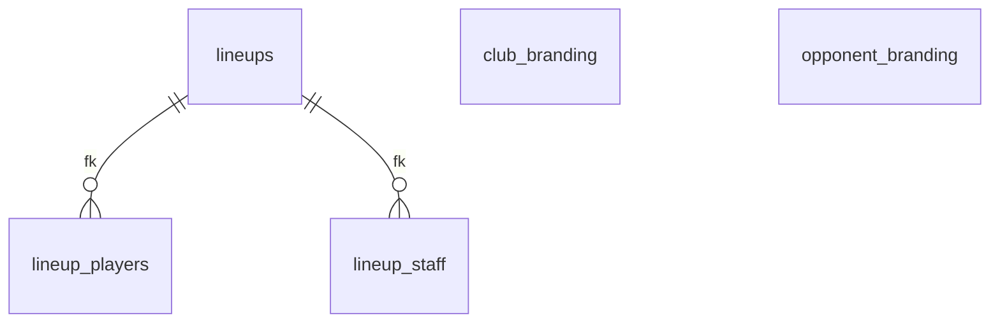

Tablas: club_branding, lineup_players, lineup_staff, lineups, opponent_branding

FK a otros dominios: `club_branding`→`clubs`, `lineup_players`→`players`, `lineup_staff`→`profiles`, `lineups`→`calendar_events`, `lineups`→`clubs`, `lineups`→`microcycles`, `lineups`→`profiles`, `opponent_branding`→`clubs`

## Partidos / Reportes

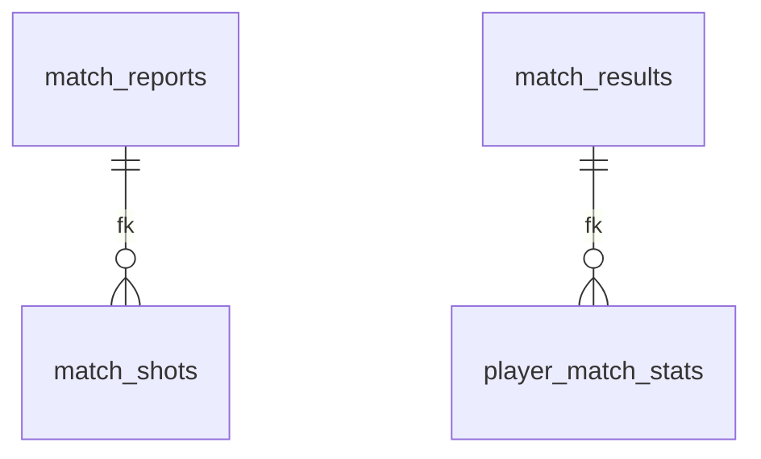

Tablas: ⚠️match_reports, match_results, ⚠️match_shots, player_match_stats

FK a otros dominios: `match_reports`→`clubs`, `match_reports`→`league_configs`, `match_reports`→`training_sessions`, `match_results`→`clubs`, `match_results`→`teams`, `match_results`→`training_sessions`, `match_shots`→`clubs`, `match_shots`→`players`, `player_match_stats`→`clubs`, `player_match_stats`→`players`

## Video

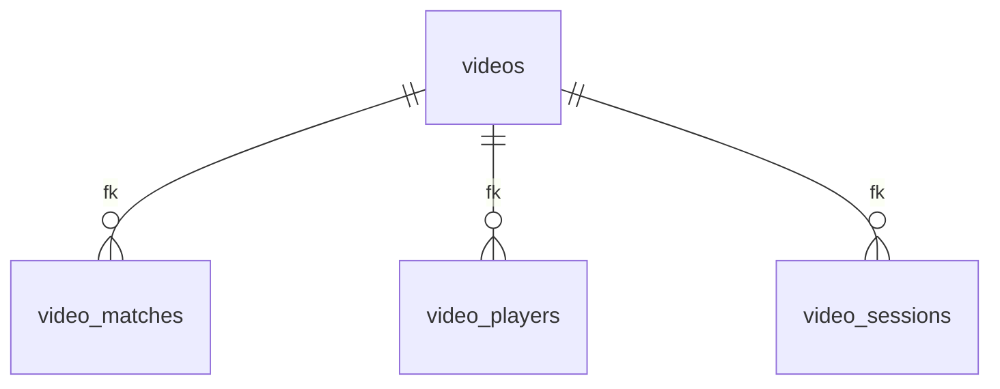

Tablas: video_matches, video_players, video_sessions, videos

FK a otros dominios: `video_matches`→`calendar_events`, `video_players`→`players`, `video_sessions`→`training_sessions`, `videos`→`clubs`, `videos`→`teams`

## Billing

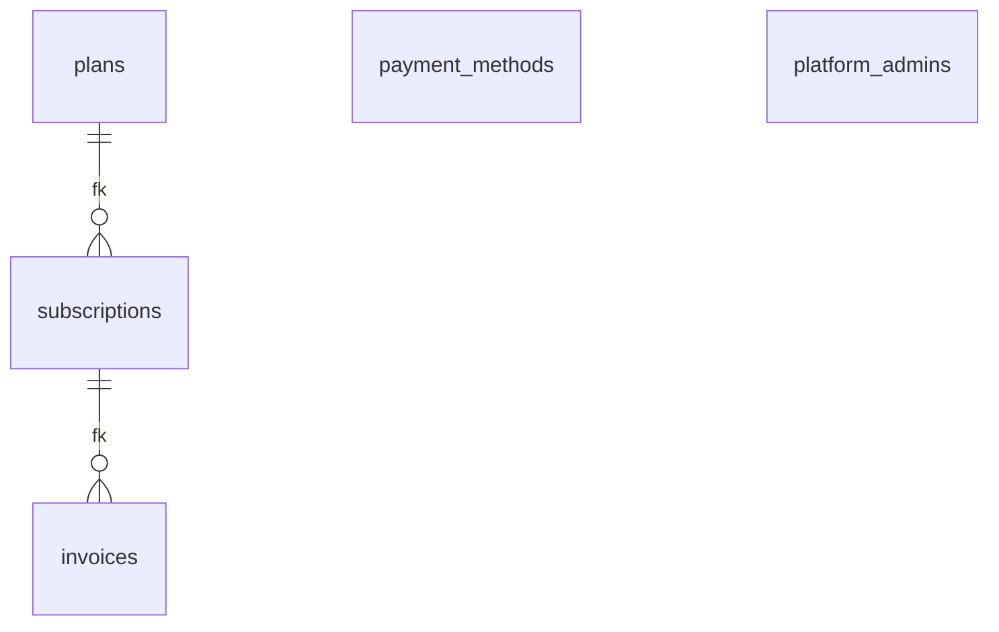

Tablas: invoices, payment_methods, plans, platform_admins, subscriptions

FK a otros dominios: `invoices`→`clubs`, `payment_methods`→`clubs`, `platform_admins`→`profiles`, `subscriptions`→`clubs`, `subscriptions`→`teams`

## Tablas sin migración (drift / esquema base)

Estas 57 tablas existen en la DB pero **no tienen `create table` en `migrations/`** —
se crearon directo en Supabase o vía `migrations/legacy/`. El esquema núcleo vive acá:

- ⚠️ `audit_log`
- ⚠️ `availability`
- ⚠️ `calendar_events`
- ⚠️ `card_accumulations`
- ⚠️ `club_modules`
- ⚠️ `club_settings`
- ⚠️ `clubs`
- ⚠️ `competitions`
- ⚠️ `drills`
- ⚠️ `evaluations`
- ⚠️ `exercise_drills`
- ⚠️ `exercises`
- ⚠️ `force_column_mappings`
- ⚠️ `force_metric_definitions`
- ⚠️ `force_test_metrics`
- ⚠️ `force_tests`
- ⚠️ `gps_dashboard_layouts`
- ⚠️ `gps_reports`
- ⚠️ `gym_exercises`
- ⚠️ `individual_block_completions`
- ⚠️ `individual_plan_blocks`
- ⚠️ `individual_plans`
- ⚠️ `injuries`
- ⚠️ `invitations`
- ⚠️ `league_configs`
- ⚠️ `load_templates`
- ⚠️ `macrocycles`
- ⚠️ `match_reports`
- ⚠️ `match_shots`
- ⚠️ `member_modules`
- ⚠️ `member_teams`
- ⚠️ `mesocycles`
- ⚠️ `messages`
- ⚠️ `microcycles`
- ⚠️ `notification_settings`
- ⚠️ `nutrition`
- ⚠️ `phase_types`
- ⚠️ `pinned_files`
- ⚠️ `player_anthropometrics`
- ⚠️ `player_individual_assignments`
- ⚠️ `player_preventive_assignments`
- ⚠️ `players`
- ⚠️ `preventive_routines`
- ⚠️ `profiles`
- ⚠️ `protocol_blocks`
- ⚠️ `rehab_plan_owners`
- ⚠️ `rehab_plans`
- ⚠️ `rehab_protocols`
- ⚠️ `rehab_sessions`
- ⚠️ `rpe`
- ⚠️ `season_phases`
- ⚠️ `seasons`
- ⚠️ `session_exercises`
- ⚠️ `tasks`
- ⚠️ `training_sessions`
- ⚠️ `treatments`
- ⚠️ `wellness`
